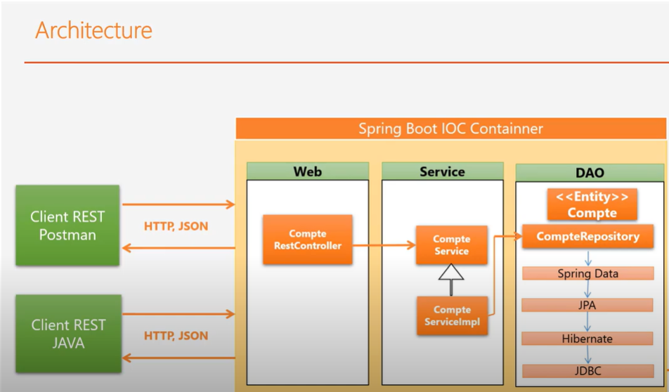
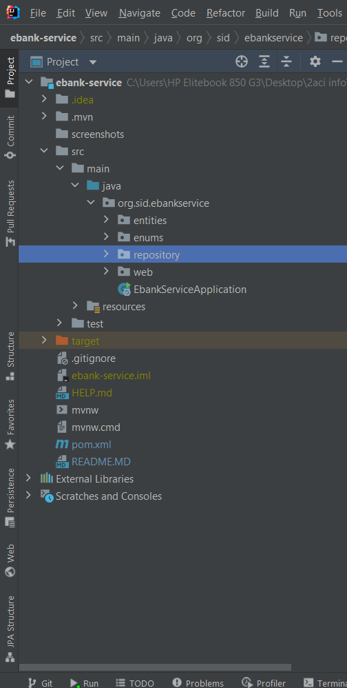
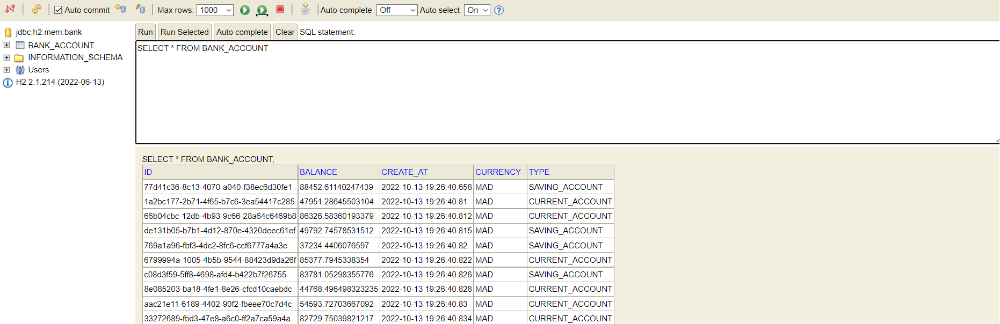
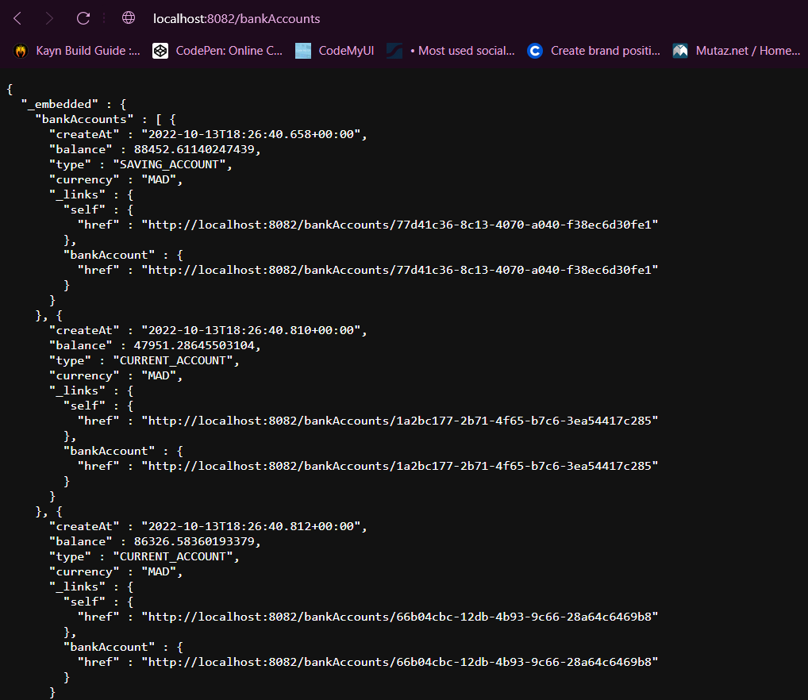
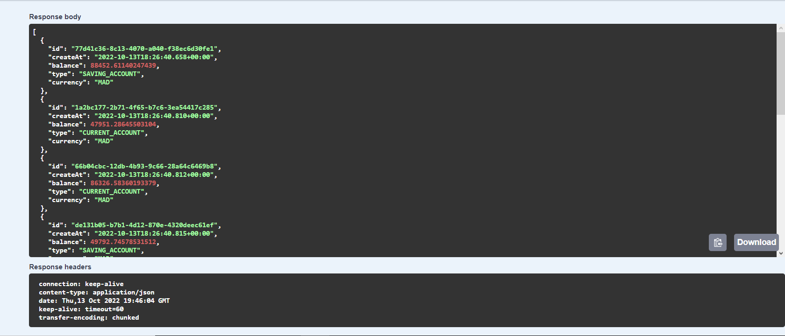
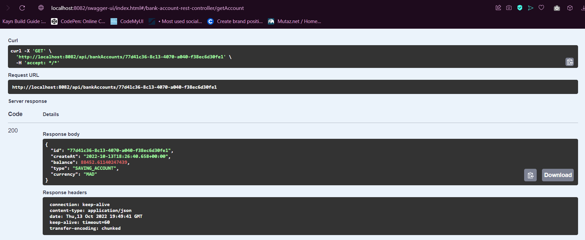
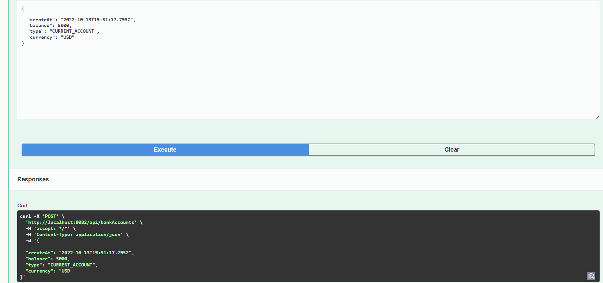
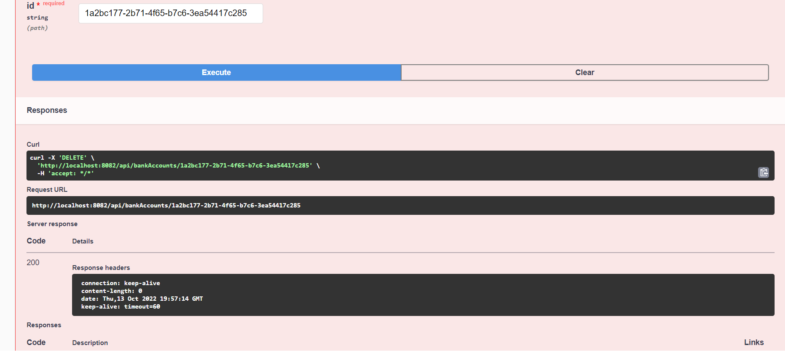

<h2>Micro service e-bank-service</h2>

<h3>Architecture du projet</h3>

<h3>Structure du projet</h3>

 
<h3>La base de donnée des comptes</h3>

 
<h3>bankAccounts JSON</h3>

 
<h3>GET pour avoir tous les comptes</h3>

 
<h3>GET pour avoir un compte specifié par son id</h3>

 
<h3>POST pour ajouter un compte</h3>

 
<h3>POST pour supprimer un compte par son id</h3>

<h4>ISSAM FLADI</h4>
